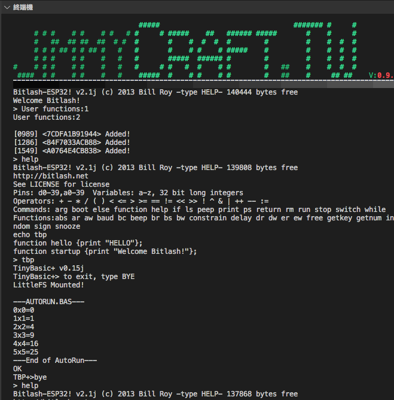

# ESP32_BitlashTBP
### ESP32 project with QEspNow &amp; Bitlash &amp; TinyBasicPlus

Script interpreters inside:  
1) Bitlash ESP32 V2.1j w/ TinyBasicPlus function added 
2) TinyBasicPlus V0.15j  
 
   
   
  

---
## References
  - [Bitlash](http://bitlash.net/) A programmable command shell for arduino.  
  - [TinyBasic+](https://github.com/BleuLlama/TinyBasicPlus) A C implementation of Tiny Basic.  
  - [TinyBasic WiKi](https://en.wikipedia.org/wiki/Tiny_BASIC) TinyBasic Wikipedia page.  
